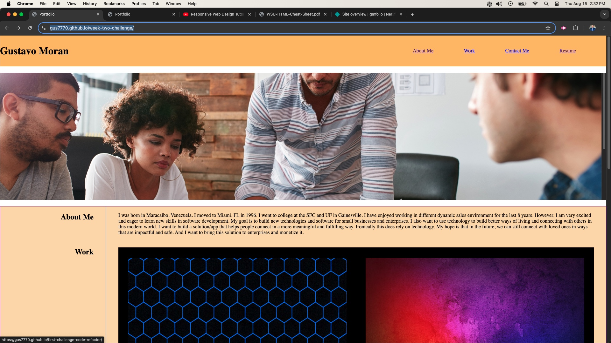

# second-challenge

# <First-Challenge-Code-Refactor>

## Description

I have a presented a portfolio of my work in software development projects as well as a resume of my previous work experience. 

## Usage

Provide instructions and examples for my portfolio. Include screenshots as needed.

<a href="https://github.com/gus7770/week-two-challenge"> Github Repo </a>

<a href="https://gus7770.github.io/week-two-challenge/"> Live Page</a>

    

  

   
   

## Credits

Created: Gustavo Moran

## License

---